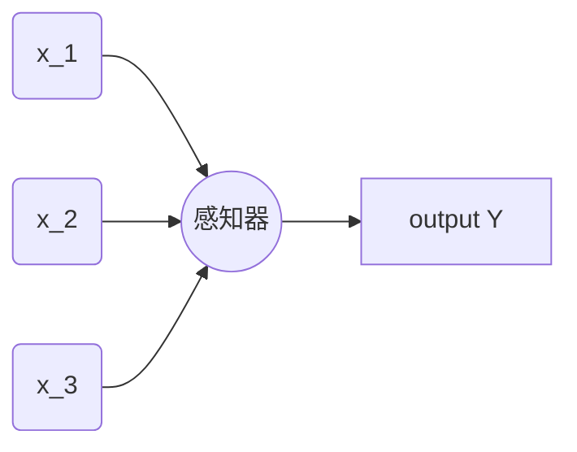

# 神经⽹络与深度学习 学习笔记

## 使⽤神经⽹络识别⼿写数字

### 感知器

感知器 是深度学习的基础单元：



⼀个感知器接受⼏个⼆进制输⼊，$x_1,x_2,...$，并产⽣⼀个⼆进制输出。引入权重 $w_i$ 来调整每个输入的重要性，我们将权重与输入相乘得到的和与阈值比较来决定输出 0 或 1。

数学公式表格为: 
$$Output = \begin{cases} 0 \  if \ \sum_j w_jx_j \leqslant threshold \\ 1 \  if \  \sum_j w_jx_j > threshold  \end{cases}$$

我们更改一下数学表达：
1. $w \cdot x \equiv \sum_j w_jx_j$ 使用矩阵点乘形式表达;
2. 阈值(threshold)的表达形式，我们令 $b=threshold$:
$$Output = \begin{cases} 0 \  if \ w \cdot x+b \leqslant 0 \\ 1 \  if \  w \cdot x+b > 0  \end{cases}$$

### S型神经元

感知器可以模拟逻辑电路，但是还可以改进逻辑输出，我们引入 S 型神经元: 
$$\sigma(z)= \dfrac{1}{1+e^{-z}} = \dfrac{1}{1+exp(-z)}$$

改进前：Step 阶跃函数图：


改进后：Sigmoid 函数图：


平滑的感知器的好处是可以更好的观察到更微小的变化：
$$\Delta output \approx \sum_j \dfrac{\partial output}{ \partial w_j} \Delta w_j + \dfrac{\partial output}{\partial b} \Delta b$$

### 神经网络结构

神经网络由三部分组成：
* 输入层 (第一层)
* 隐藏层 (中间若干层)
* 输出层 (最后一层)

举例：


网络分类：
* 前反馈网络
* 递归神经网络

### 代价函数
神经网络中衡量学习好坏的函数为 **代价函数** :
$$C(w,b) \equiv \dfrac{1}{2n}\sum_x \Vert y(x) -a \Vert^2$$

其中：
* $w$ 表⽰所有的⽹络中权重的集合
* $b$ 是所有的偏置
* $n$ 是训练输⼊数据的个数
* $a$ 是表⽰当输⼊为 $x$ 时输出的向量，求和则是在总的训练输⼊ $x$ 上进⾏的
* 符号 $\Vert v \Vert$ 是指向量 $v$ 的模。

输出$a$ 取决于 $x$ , $w$ 和 $b$ 


我们把 $C$ 称为⼆次代价函数；有时也称被称为 **均⽅误差** 或者 $MSE$。

函数特性：
1. 非负
2. 最小为0，表示网络拟合与实际十分接近，反之表示拟合不理想，与正确情况相差很远

专注于代价函数(最⼩化⼆次代价)，只有这样，我们之后才能测试分类精度

### 梯度下降

如小球从山顶滑落，分解每个小步骤，小球都向着下降方向最大的地方移动

假设 代价函数：$C(v_1,v_2)$
数学公式推到:
1. 移动很小的量: $\Delta C \approx \dfrac{\partial C}{\partial v_1}\Delta v_1 + \dfrac{\partial C}{\partial v_2} \Delta v_2$
2. 定义 $v$ 的变化向量 : $\Delta v \equiv (\Delta v_1,\Delta v_2)^T$ 其中 $T$ 为转置符号
3. 定义 $C$ 的梯度为偏导数的向量: $\nabla C \equiv \Bigl(\dfrac{\partial C}{\partial v_1} , \dfrac{\partial C}{\partial v_2} \Bigr)^T$
4. 重写 $\Delta C$, $\Delta C \approx \nabla C \cdot \Delta v$
5. 假设 $\Delta v = - \eta \nabla C$ ，其中  $\eta$ 为学习率，是个很小的正数
6. 推导: $\Delta C \approx -\eta \nabla C \cdot \nabla C = - \eta \Vert \nabla C \Vert^2$ 
其中 $\Vert \nabla C \Vert^2 \geqslant 0$ 保证了 $C$ 会一直减小  

如果推广到多维情况：
* $C$ 有 $m$ 维，即变量有 $v_1,v_2,...,v_m$, 那么自变量向量为: $\Delta v = (\Delta v_1,...,\Delta v_m)^T$
* $\nabla C \equiv \Bigl(\dfrac{\partial C}{\partial v_1} ,..., \dfrac{\partial C}{\partial v_m} \Bigr)^T$

梯度下降法可以被视为⼀种在 $C$ 下降最快的⽅向上做微⼩变化的⽅法

代价函数一般形式 $C=\dfrac{1}{n} \sum_x C_x$ 它是遍及每个训练样本代价 $C_x \equiv \dfrac{\Vert y(x) - a \Vert^2}{2}$

### 随机梯度下降

如果在神经网络中对每个样本使用梯度下降会非常耗费时间，随机梯度下降算法则是通过随机算去销量驯良输入样本来计算 $\nabla C_x$，进而估算梯度 $\nabla C$

随机梯度下降通过随机选取⼩量的 $m$ 个训练输⼊来⼯作。我们将这些随机的训练输⼊标记为$X_1,X_2, ... ,X_m$，并把它们称为⼀个⼩批量数据(**mini-batch**)。假设样本数量 $m$ ⾜够⼤，我们期望$\nabla C_{X_j}$ 的平均值⼤致相等于整个 $\nabla C_X$ 的平均值，即:
$$\dfrac{\sum^m_{j=1} \nabla C_{X_j}}{m} \approx \dfrac{\sum_x \nabla C_x}{n} = \nabla C$$
从而可以得到：$\nabla C \approx \dfrac{1}{m} \sum^m_{j=1} \nabla C_{X_j}$

假设 $w_k$ 和 $b_l$ 表⽰我们神经⽹络中权重和偏置。
$w_k \to w'k = w_k - \dfrac{\eta}{m} \sum_j \dfrac{\partial C_{X_j}}{\partial w_k}$
$b_l \to b'l = b_l - \dfrac{\eta}{m} \sum_j \dfrac{\partial C_{X_j}}{\partial b_l}$

当我们用完了所有的训练输入，则称为完成了一个训练迭代期(**epoch**)

在线、online、on-line、或者递增学习 是指小批量数据个数为1，单次是训练学习一个数据的学习过程

实现我们的⽹络来分类数字:

``` python
# %load network.py
"""
network.py
------------------------
IT WORKS
A module to implement the stochastic gradient descent learning
algorithm for a feedforward neural network.  Gradients are calculated
using backpropagation.  Note that I have focused on making the code
simple, easily readable, and easily modifiable.  It is not optimized,
and omits many desirable features.
"""

#### Libraries
# Standard library 标准工具包
import random 

# Third-party libraries 第三方工具包
import numpy as np

class Network(object):
    def __init__(self, sizes):
        """The list ``sizes`` contains the number of neurons in the
        respective layers of the network.  For example, if the list
        was [2, 3, 1] then it would be a three-layer network, with the
        first layer containing 2 neurons, the second layer 3 neurons,
        and the third layer 1 neuron.  The biases and weights for the
        network are initialized randomly, using a Gaussian
        distribution with mean 0, and variance 1.  Note that the first
        layer is assumed to be an input layer, and by convention we
        won't set any biases for those neurons, since biases are only
        ever used in computing the outputs from later layers."""
        self.num_layers = len(sizes) # 网络层数 [2,3,1] 共3层
        self.sizes = sizes # 网络
        # 生成偏置
        self.biases = [np.random.randn(y, 1) for y in sizes[1:]] 
        # 生成权重
        self.weights = [np.random.randn(y, x)
                        for x, y in zip(sizes[:-1], sizes[1:])]

    def feedforward(self, a):
        """Return the output of the network if ``a`` is input."""
        for b, w in zip(self.biases, self.weights):
            a = sigmoid(np.dot(w, a)+b)
        return a

    def SGD(self, training_data, epochs, mini_batch_size, eta,
            test_data=None):
        """Train the neural network using mini-batch stochastic
        gradient descent.  The ``training_data`` is a list of tuples
        ``(x, y)`` representing the training inputs and the desired
        outputs.  The other non-optional parameters are
        self-explanatory.  If ``test_data`` is provided then the
        network will be evaluated against the test data after each
        epoch, and partial progress printed out.  This is useful for
        tracking progress, but slows things down substantially."""

        training_data = list(training_data)
        n = len(training_data)

        if test_data:
            test_data = list(test_data)
            n_test = len(test_data)

        for j in range(epochs): # 根据 epochs 训练
            random.shuffle(training_data)
            mini_batches = [ # 小批量 数据集生成
                training_data[k:k+mini_batch_size]
                for k in range(0, n, mini_batch_size)]
            for mini_batch in mini_batches: # 小批量学习
                self.update_mini_batch(mini_batch, eta)
            if test_data:
                print("Epoch {} : {} / {}".format(j,self.evaluate(test_data),n_test));
            else:
                print("Epoch {} complete".format(j))

    def update_mini_batch(self, mini_batch, eta):
        """Update the network's weights and biases by applying
        gradient descent using backpropagation to a single mini batch.
        The ``mini_batch`` is a list of tuples ``(x, y)``, and ``eta``
        is the learning rate."""
        nabla_b = [np.zeros(b.shape) for b in self.biases]
        nabla_w = [np.zeros(w.shape) for w in self.weights]
        for x, y in mini_batch:
            delta_nabla_b, delta_nabla_w = self.backprop(x, y)
            nabla_b = [nb+dnb for nb, dnb in zip(nabla_b, delta_nabla_b)]
            nabla_w = [nw+dnw for nw, dnw in zip(nabla_w, delta_nabla_w)]
        self.weights = [w-(eta/len(mini_batch))*nw
                        for w, nw in zip(self.weights, nabla_w)]
        self.biases = [b-(eta/len(mini_batch))*nb
                       for b, nb in zip(self.biases, nabla_b)]

    def backprop(self, x, y):
        """Return a tuple ``(nabla_b, nabla_w)`` representing the
        gradient for the cost function C_x.  ``nabla_b`` and
        ``nabla_w`` are layer-by-layer lists of numpy arrays, similar
        to ``self.biases`` and ``self.weights``."""
        nabla_b = [np.zeros(b.shape) for b in self.biases]
        nabla_w = [np.zeros(w.shape) for w in self.weights]
        # feedforward
        activation = x
        activations = [x] # list to store all the activations, layer by layer
        zs = [] # list to store all the z vectors, layer by layer
        for b, w in zip(self.biases, self.weights):
            z = np.dot(w, activation)+b
            zs.append(z)
            activation = sigmoid(z)
            activations.append(activation)
        # backward pass
        delta = self.cost_derivative(activations[-1], y) * \
            sigmoid_prime(zs[-1])
        nabla_b[-1] = delta
        nabla_w[-1] = np.dot(delta, activations[-2].transpose())
        # Note that the variable l in the loop below is used a little
        # differently to the notation in Chapter 2 of the book.  Here,
        # l = 1 means the last layer of neurons, l = 2 is the
        # second-last layer, and so on.  It's a renumbering of the
        # scheme in the book, used here to take advantage of the fact
        # that Python can use negative indices in lists.
        for l in range(2, self.num_layers):
            z = zs[-l]
            sp = sigmoid_prime(z)
            delta = np.dot(self.weights[-l+1].transpose(), delta) * sp
            nabla_b[-l] = delta
            nabla_w[-l] = np.dot(delta, activations[-l-1].transpose())
        return (nabla_b, nabla_w)

    def evaluate(self, test_data):
        """Return the number of test inputs for which the neural
        network outputs the correct result. Note that the neural
        network's output is assumed to be the index of whichever
        neuron in the final layer has the highest activation."""
        test_results = [(np.argmax(self.feedforward(x)), y)
                        for (x, y) in test_data]
        return sum(int(x == y) for (x, y) in test_results)

    def cost_derivative(self, output_activations, y):
        """Return the vector of partial derivatives \partial C_x /
        \partial a for the output activations."""
        return (output_activations-y)

#### Miscellaneous functions
def sigmoid(z):
    """The sigmoid function."""
    return 1.0/(1.0+np.exp(-z))

def sigmoid_prime(z):
    """Derivative of the sigmoid function."""
    return sigmoid(z)*(1-sigmoid(z))
```

训练过程中需要找到 合适的学习率 $\eta$ 进行训练,评判学习效果，需要使用基准进行比对 (Baseline)
目前得到的结论： **复杂的算法** $\leqslant$ **简单的学习算法 + 好的训练数据**

### 深度神经网络

包含多层结构(两层或更多隐藏层)的⽹络被称为深度神经⽹络。

## 反向传播 (快速梯度计算方法)

反向传播的核心是一个对 **代价函数** $C$ 关于任何权重 $w$ ( 或者偏置 $b$ ) 的偏导数 $\dfrac{\partial C}{\partial w}$ 的表达式。
这个表达式告诉我们在改变 **权重** 和 **偏置** 时，**代价函数变化的快慢**

### 神经网络中使用矩阵快速计算输出的方法

我们使⽤ $w^l_{jk}$ 表⽰从 $(l - 1)^{th}$ 层的 $k^{th}$ 个神经元到 $k^{th}$ 层的 $j^{th}$ 个神经元的链接上的权重。


我们使⽤ $b^l_j$ 表⽰在 $l^{th}$ 层第 $j^{th}$ 个神经元的偏置，使⽤ $a^l_j$ 表⽰ $l^{th}$ 层第 $j^{th}$ 个神经元的激活值。


将变量联系到一起： $a^l_j = \sigma \Bigl( \sum_k w^l_{jk} a^{l-1}_k + b^l_j \Bigr)$

**使用矩阵表示：**

我们对每⼀层 $l$ 都定义⼀个 **权重矩阵** $w^l$ 定义⼀个 **偏置向量** $b^l$ 。

向量形式: $a^l = \sigma (w^l a^{l-1} + b^l) = \sigma (z^l)$

其中， $z^l \equiv w^l a^{l-1} + b^l$ ，我们称 $z^l$ 为 $l$ 层神经元的 **带权输⼊**

同样要指出的是 $z^l$ 的每个元素是 $z^l_j  = \sum_k w^k_{jk} a^{l-1}_k + b^l_j$ ，其实 $z^l_j$ 就是第 $l$ 层第 $j$ 个神经元的激活函数的带权输⼊。

### 关于代价函数的两个假设

⼆次代价函数有下列形式：$C = \dfrac{1}{2n} \sum_x \Vert y(x)-a^L(x) \Vert^2$
其中 $n$ 是训练样本的总数；求和运算遍历了每个训练样本 $x$ ；$y = y(x)$ 是对应的⽬标输出；$L$ 表⽰⽹络的层数；$a^L$ = $a^L(x)$ 是当输⼊是 $x$ 时的⽹络输出的激活值向量。

假设：
1. 第⼀个假设就是代价函数可以被写成⼀个在每个训练样本 $x$ 上的代价函数 $C_x$ 的均值 $C=\dfrac{1}{n} \sum_x C_x$
    其中对每个独⽴的训练样本其代价是 $C_x = \dfrac{1}{2} \Vert y-a^L \Vert^2$ 
2. 第⼆个假设就是代价可以写成神经⽹络输出的函数 

### Hadamard 乘积 $s \odot t$ (Schur 乘积)

$s \odot t$ 表示 **按元素** 乘积，  $(s \odot t)_j = s_jt_j$ 例如：
$$\begin{bmatrix}1\\2\end{bmatrix} \odot \begin{bmatrix}3\\4\end{bmatrix} = \begin{bmatrix}1*3\\2*4\end{bmatrix} = \begin{bmatrix}3\\8\end{bmatrix}$$

### 反向传播的四个基本方程

反向传播其实是对权重和偏置变化影响代价函数过程的理解。
我们⾸先引⼊⼀个中间量，$\delta^l_j$，这个我们称为在 $l^{th}$ 层第 $j^{th}$ 个神经元上的 **误差**

反向传播将给出计算误差 $\delta^l_j$ 的流程，然后将其关联到计算$\dfrac{\partial C}{\partial w^l_{jk}}$和$\dfrac{\partial C}{\partial b^l_j}$上。

这里可以认为： $\dfrac{\partial C}{\partial z^l_j}$ 是神经元的误差的度量
我们定义 $l$ 层的第 $j^{th}$ 个神经元上的误差 $\delta^l_j$ 为： $\delta^l_j \equiv \dfrac{\partial C}{\partial z^l_j}$

**四个基本方程：**

1. **BP1** 输出层误差的方程 $\delta^L$，每个元素定义如下: $\delta^L_j = \dfrac{\partial C}{\partial a^L_j} \sigma'(z^L_j)$
    右式第一项：$\dfrac{\partial C}{\partial a^L_j}$ 表示代价随着 $j^{th}$ 输出激活值的变化而变化的速度
    右式第二项：$\sigma'(z^L_j)$ 刻画了在 $z^L_j$ 处激活函数 $\sigma$ 变化的速度
    矩阵形式为：$\delta^L = \nabla_aC \cdot \sigma'(z^L)$ 

2. **BP2** 使⽤下⼀层的误差 $\delta^{l+1}$ 来表⽰当前层的误差 $\delta^l$： $\delta^l = ((w^{l+1})^T \delta^{l+1}) \cdot \sigma '(z^l)$
    沿着⽹络 **反向** 移动误差

3. **BP3** 代价函数关于⽹络中任意偏置的改变率： $\dfrac{ \partial C}{ \partial b^l_j} = \delta ^l_j$ 
    简写: $\dfrac{ \partial C}{ \partial b} = \delta$

4. **BP4** 代价函数关于任何⼀个权重的改变率：$\dfrac{\partial C}{ \partial w^l_{jk}} = a^{l-1}_k \delta^l_j$
    简写: $\dfrac{\partial C}{ \partial w} = a_{in} \delta_{out}$
    其中 $a_in$ 是输⼊给权重 $w$ 的神经元的激活值，$\delta_{out}$ 是输出⾃权重 $w$ 的神经元的误差。
    如果 $a_{in} \approx 0$，梯度 $\dfrac{\partial C}{ \partial w}$ 也会趋向很⼩。称这种现象为 **权重缓慢学习**

### 反向传播算法
1. 输入 $x$: 为输入层设置对应的激活值 $a^l$
2. 前向传播: 对每个 $l=2,3,...,L$ 计算相应的 $z^l = w^l a^{l-1}+b^l$ 和 $a^l = \sigma(z^l)$
3. 输出层误差$\delta^L$ : 计算向量 $\delta^L = \nabla_a C \cdot \sigma'(z^L)$
4. 反向误差传播：对每个 $l=L-1,L-2,...,2$，计算 $\delta^l = ((w^{l+1})^T \delta^{l+1}) \cdot \sigma'(z^l)$
5. 输出：代价函数的梯度由 $\dfrac{\partial C}{\partial w^l_{jk}} = a^{l-1}_k \sigma^l_j$ 和 $\dfrac{\partial C}{\partial b^l_j} = \delta^l_j$

