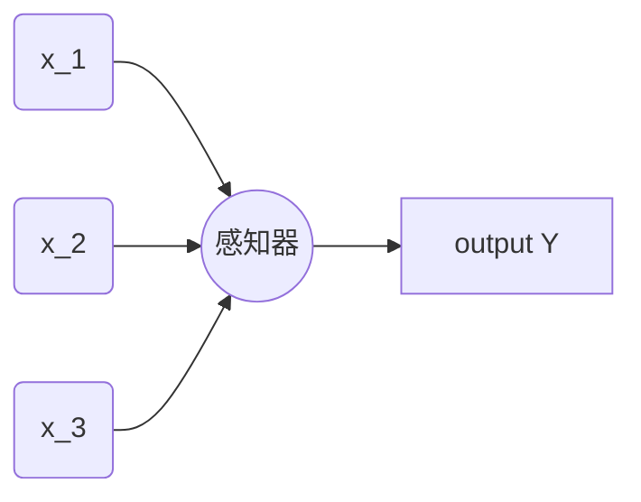

# 神经⽹络与深度学习 学习笔记

## 使⽤神经⽹络识别⼿写数字

### 感知器

感知器 是深度学习的基础单元：

⼀个感知器接受⼏个⼆进制输⼊，$x_1,x_2,...$，并产⽣⼀个⼆进制输出。引入权重 $w_i$ 来调整每个输入的重要性，我们将权重与输入相乘得到的和与阈值比较来决定输出 0 或 1。

数学公式表格为: 
$$Output = \begin{cases} 0 \  if \ \sum_j w_jx_j \leqslant threshold \\ 1 \  if \  \sum_j w_jx_j > threshold  \end{cases}$$

我们更改一下数学表达：
1. $w \cdot x \equiv \sum_j w_jx_j$ 使用矩阵点乘形式表达;
2. 阈值(threshold)的表达形式，我们令 $b=threshold$:
$$Output = \begin{cases} 0 \  if \ w \cdot x+b \leqslant 0 \\ 1 \  if \  w \cdot x+b > 0  \end{cases}$$

### S型神经元

感知器可以模拟逻辑电路，但是还可以改进逻辑输出，我们引入 S 型神经元: 
$$\sigma(z)= \dfrac{1}{1+e^{-z}} = \dfrac{1}{1+exp(-z)}$$

改进前：Step 阶跃函数图：

改进后：Sigmoid 函数图：

平滑的感知器的好处是可以更好的观察到更微小的变化：
$$\Delta output \approx \sum_j \dfrac{\partial output}{ \partial w_j} \Delta w_j + \dfrac{\partial output}{\partial b} \Delta b$$

### 神经网络结构

神经网络由三部分组成：
* 输入层 (第一层)
* 隐藏层 (中间若干层)
* 输出层 (最后一层)

举例：

网络分类：
* 前反馈网络
* 递归神经网络

### 代价函数
神经网络中衡量学习好坏的函数为 **代价函数** :
$$C(w,b) \equiv \dfrac{1}{2n}\sum_x \Vert y(x) -a \Vert^2$$

其中：
* $w$ 表⽰所有的⽹络中权重的集合
* $b$ 是所有的偏置
* $n$ 是训练输⼊数据的个数
* $a$ 是表⽰当输⼊为 $x$ 时输出的向量，求和则是在总的训练输⼊ $x$ 上进⾏的
* 符号 $\Vert v \Vert$ 是指向量 $v$ 的模。

输出$a$ 取决于 $x$ , $w$ 和 $b$ 

我们把 $C$ 称为⼆次代价函数；有时也称被称为 **均⽅误差** 或者 $MSE$。

函数特性：
1. 非负
2. 最小为0，表示网络拟合与实际十分接近，反之表示拟合不理想，与正确情况相差很远

专注于代价函数(最⼩化⼆次代价)，只有这样，我们之后才能测试分类精度

### 梯度下降

如小球从山顶滑落，分解每个小步骤，小球都向着下降方向最大的地方移动

假设 代价函数：$C(v_1,v_2)$
数学公式推到:
1. 移动很小的量: $\Delta C \approx \dfrac{\partial C}{\partial v_1}\Delta v_1 + \dfrac{\partial C}{\partial v_2} \Delta v_2$
2. 定义 $v$ 的变化向量 : $\Delta v \equiv (\Delta v_1,\Delta v_2)^T$ 其中 $T$ 为转置符号
3. 定义 $C$ 的梯度为偏导数的向量: $\nabla C \equiv \Bigl(\dfrac{\partial C}{\partial v_1} , \dfrac{\partial C}{\partial v_2} \Bigr)^T$
4. 重写 $\Delta C$, $\Delta C \approx \nabla C \cdot \Delta v$
5. 假设 $\Delta v = - \eta \nabla C$ ，其中  $\eta$ 为学习率，是个很小的正数
6. 推导: $\Delta C \approx -\eta \nabla C \cdot \nabla C = - \eta \Vert \nabla C \Vert^2$ 
其中 $\Vert \nabla C \Vert^2 \geqslant 0$ 保证了 $C$ 会一直减小  

如果推广到多维情况：
* $C$ 有 $m$ 维，即变量有 $v_1,v_2,...,v_m$, 那么自变量向量为: $\Delta v = (\Delta v_1,...,\Delta v_m)^T$
* $\nabla C \equiv \Bigl(\dfrac{\partial C}{\partial v_1} ,..., \dfrac{\partial C}{\partial v_m} \Bigr)^T$

梯度下降法可以被视为⼀种在 $C$ 下降最快的⽅向上做微⼩变化的⽅法

代价函数一般形式 $C=\dfrac{1}{n} \sum_x C_x$ 它是遍及每个训练样本代价 $C_x \equiv \dfrac{\Vert y(x) - a \Vert^2}{2}$

### 随机梯度下降

如果在神经网络中对每个样本使用梯度下降会非常耗费时间，随机梯度下降算法则是通过随机算去销量驯良输入样本来计算 $\nabla C_x$，进而估算梯度 $\nabla C$

随机梯度下降通过随机选取⼩量的 $m$ 个训练输⼊来⼯作。我们将这些随机的训练输⼊标记为$X_1,X_2, ... ,X_m$，并把它们称为⼀个⼩批量数据(**mini-batch**)。假设样本数量 $m$ ⾜够⼤，我们期望$\nabla C_{X_j}$ 的平均值⼤致相等于整个 $\nabla C_X$ 的平均值，即:
$$\dfrac{\sum^m_{j=1} \nabla C_{X_j}}{m} \approx \dfrac{\sum_x \nabla C_x}{n} = \nabla C$$
从而可以得到：$\nabla C \approx \dfrac{1}{m} \sum^m_{j=1} \nabla C_{X_j}$

假设 $w_k$ 和 $b_l$ 表⽰我们神经⽹络中权重和偏置。
$w_k \to w'k = w_k - \dfrac{\eta}{m} \sum_j \dfrac{\partial C_{X_j}}{\partial w_k}$
$b_l \to b'l = b_l - \dfrac{\eta}{m} \sum_j \dfrac{\partial C_{X_j}}{\partial b_l}$

当我们用完了所有的训练输入，则称为完成了一个训练迭代期(**epoch**)

在线、online、on-line、或者递增学习 是指小批量数据个数为1，单次是训练学习一个数据的学习过程

