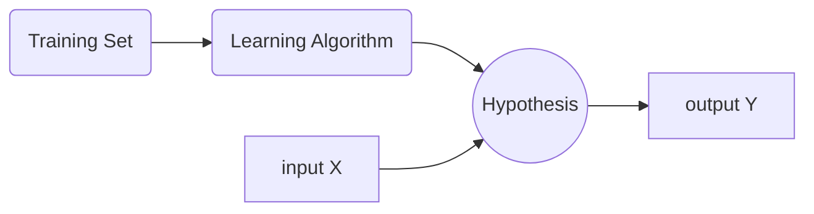

# 单变量线性回归
## 监督学习模型
参数说明:  
| 参数                | 解释                                  | 翻译            |
| :-----------------: | :-----------------------------------: | :-------------: |
| m                   | Number of training examples           | 训练的样本数    |
| x's                 | "input" variable / features           | 输入变量/特征   |
| y's                 | "output" variable / "target" variable | 输出变量/特征   |
| (x,y)               | one training example                  | 一个训练样本    |
| $(x^{(i)},y^{(i)})$ | $i^{th}$ training example             | 第 i 个训练样本 |

### Linear regression 线性回归
* Univariate linear regression 单变量线性回归
    >  $h_{\theta}(x) = \theta_0 + \theta_1 x$ 
    > $\theta_0,\theta_1$ is Parameters 参数（需要优化的部分）
    > 为了优化参数 $\theta_0$ 与 $\theta_1$,我们希望 $\underset{\theta_0 \theta_1}{minimize}\dfrac{1}{2m} \displaystyle\sum_{i =1}^{m} (h_{\theta}(x)-y)^2$
    >  

### Cost function 误差代价函数 
* Cost function 误差代价函数
    >  数学表达式 : $J(\theta_0,\theta_1)=\dfrac{1}{2m} \displaystyle\sum_{i =1}^{m} (h_{\theta}(x^{(i)})-y^{(i)})^2$  
    > 称之 **Square error cost function** 平方误差代价函数
    >  

* 单变量回归需要优化的数学表达式 : 
  $$ \underset{\theta_0 \theta_1}{minimize } J(\theta_0,\theta_1)=\dfrac{1}{2m} \displaystyle\sum_{i =1}^{m} (h_{\theta}(x^{(i)})-y^{(i)})^2 $$

### 单变量线性回归小结
| 参数 | 说明 | 表达式|
|:--:|:--:|:--:|
|Hypothesis|假设函数|$h_{\theta}(x) = \theta_0 + \theta_1 x$|
|Parameters|参数|$\theta_0,\theta_1$|
|Cost Function|误差代价函数|$J(\theta_0,\theta_1)=\dfrac{1}{2m} \displaystyle\sum_{i =1}^{m} (h_{\theta}(x^{(i)})-y^{(i)})^2$|
|Goal|目标|$\underset{\theta_0 \theta_1}{minimize } J(\theta_0,\theta_1)$|

* $h_\theta(x)$ for fixed $\theta_0,\theta_1$, this is a function of $x$
$h_\theta(x)$ 是关于 $x$ 的函数
* $J(\theta_0,\theta_1)$ function of parameter $\theta_0,\theta_1$ 
$J(\theta_0,\theta_1)$ 是关于 $\theta_0,\theta_1$ 的函数
### 求最佳拟合函数
通过不断调整 $\theta_0,\theta_1$ 使得 $J(\theta_0,\theta_1)$ 最小，从而得到最合适的参数 $\theta_0,\theta_1$，使得函数与数据拟合。换句话说理解为与数据误差最小。

### **Contour figure** 等高图
等高图类似碗，碗底是误差最小点，也是最佳拟合点，此时参数是最佳参数。
> 用于直观理解 `cost function` 代价函数与参数的关系

## **Gradient descent** 梯度下降算法 
* Task 任务 ： Have some function $J(\theta_0,\theta_1)$, Want $\underset{\theta_0 \theta_1}{min} J(\theta_0,\theta_1)$
* Outline 概述 : 
    * Start with some $\theta_0,\theta_1$ 
        > 给定初始值 $\theta_0,\theta_1$
    * Keep changing $\theta_0,\theta_1$ to reducee $J(\theta_0,\theta_1)$ until we hopefully end up at a minimum
        > 调整 $\theta_0,\theta_1$ 使得 $J(\theta_0,\theta_1)$ 保持下降，最终到最小

### **Gradient descent algorithm** 算法原理
需要构建一种使 $J(\theta_0,\theta_1)$ 下降到最小值的算法：Gradient descent 梯度下降算法 
>  repeat until convergence 
> {
> $\theta_j := \theta_j - \alpha \dfrac{\partial}{\partial\theta_j} J(\theta_0,\theta_1)$ (for $j=0$ and $j=1$)
> }
> 
> Correct : Simultaneous update
> 
> `temp0` : = $\theta_0 - \alpha \dfrac{\partial}{\partial\theta_0} J(\theta_0,\theta_1)$
> 
> `temp1` : = $\theta_1 - \alpha \dfrac{\partial}{\partial\theta_1} J(\theta_0,\theta_1)$
> 
> $\theta_0$ := `temp0`
> $\theta_1$ := `temp1`
>  

特别需要注意:
1. `:=` assignment-operator 赋值操作符; 
2. `=` 判断是否相等
3. $\alpha$ learning rate 学习率，控制梯度下降的参数
4. **必须同时计算参数 temp 后再更新参数** $\theta_0,\theta_1$ ... 否则不是规范的梯度下降算法，引起更新不同时带来的偏差

### **Gradient descent** 算法更新原理
假设 $J(\theta_1) (\theta_1 \in \real)$

更新数学表达式为 :$\theta_1 := \theta_1 - \alpha * \dfrac{\partial}{\partial\theta_1} J(\theta_1)$

#### $\dfrac{\partial}{\partial\theta_1} J(\theta_1)$ 微分项对参数更新的影响
* $\dfrac{\partial}{\partial\theta_1} J(\theta_1) \ge 0$ ,情况为: $\theta_1 := \theta_1 - \alpha$ * (positive number 正数)
* $\dfrac{\partial}{\partial\theta_1} J(\theta_1) \le 0$ ,情况为: $\theta_1 := \theta_1 - \alpha$ * (negative number 负数)
---
#### $\alpha$ 取值对 **Gradient descent** 算法的影响 
+ 如果 $\alpha$ 太 **小**，梯度下降算法运行到 **cost fuction** 最小值会很慢
+ 如果 $\alpha$ 太 **大**，梯度下降算法会在接近 **cost fuction** 最小值时，跳过最小值，从而导致无法收敛
+ 如果有合适的 $\theta_1$ 使 $J(\theta_1)$ 刚好处于 **local optima** 局部最优解处，则 $\dfrac{\partial}{\partial\theta_1} J(\theta_1) = 0$ ， 迭代更新将停止。
    > 更新公示此时为 : $\theta_1 := \theta_1 - \alpha * 0 := \theta_1$ 即无更新

Gradient descent can converge to a local minimum, even with the learning rate $\alpha$ fixed.
>  梯度下降法 即使在不合适的学习率 $\alpha$ 下，也会收敛到局部最小点。
> 梯度下降法越接近局部最小点，微分项 $\dfrac{\partial}{\partial\theta_1} J(\theta_1)$ 越小，即更新幅度越小
>  

###  微分项推到过程
假设 $h_{\theta}(x) = \theta_0 + \theta_1 x$ 

$\dfrac{\partial}{\partial\theta_j} J(\theta_0.\theta_1) = \dfrac{\partial}{\partial\theta_j} · \dfrac{1}{2m} \displaystyle\sum_{i =1}^{m} (h_{\theta}(x^{(i)})-y^{(i)})^2 =\dfrac{\partial}{\partial\theta_j} · \dfrac{1}{2m} \displaystyle\sum_{i =1}^{m} (\theta_0 + \theta_1 x^{(i)}-y^{(i)})^2$

---
* $j=0$ 时，则 $\theta_j = \theta_0$
    >  $\dfrac{\partial}{\partial\theta_0} J(\theta_0.\theta_1) = \dfrac{1}{m} \displaystyle\sum_{i=1}^{m} (h_{\theta}(x^{(i)})-y^{(i)})$
    >  

* $j=1$ 时，则 $\theta_j = \theta_1$
    >  $\dfrac{\partial}{\partial\theta_1} J(\theta_0.\theta_1) = \dfrac{1}{m} \displaystyle\sum_{i=1}^{m} (h_{\theta}(x^{(i)})-y^{(i)}) · x^{(i)}$
    >  

将上述推到结果代入到梯度下降算法中：
> repeat until convergence 
> {
> $\theta_0 := \theta_0 - \alpha \dfrac{\partial}{\partial\theta_0} J(\theta_0,\theta_1):= \theta_0 - \alpha · \dfrac{1}{m} \displaystyle\sum_{i=1}^{m} (h_{\theta}(x^{(i)})-y^{(i)})$ 
> $\theta_1 := \theta_1 - \alpha \dfrac{\partial}{\partial\theta_1} J(\theta_0,\theta_1):= \theta_1 - \alpha · \dfrac{1}{m} \displaystyle\sum_{i=1}^{m} (h_{\theta}(x^{(i)})-y^{(i)}) · x^{(i)}$ 
> }

线性回归 代价函数总是呈 **convex**  凸函数 (弓状函数 bow-shaped)， 利用梯度下降算法总能收敛到全局最优解

### "Batch" Gredient Descent
"Batch": Each step of gradient descent uses all the training examples.
> 每一步梯度下降，都遍历整个训练集的样本