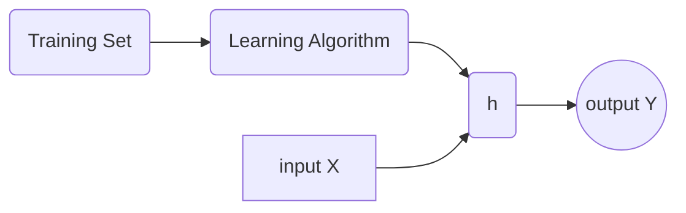

# 单变量线性回归
## 监督学习模型
参数说明:  
| 参数 | 解释 | 翻译 |
|:-----:|:-----:|:-----:|
|m|Number of training examples| 训练的样本数 |
|x's|"input" variable / features| 输入变量/特征|
|y's|"output" variable / "target" variable| 输出变量/特征|
|(x,y)|one training example|一个训练样本|
|$(x^{(i)},y^{(i)})$|$i^{th}$ training example|第 i 个训练样本|

### Linear regression 线性回归
* Univariate linear regression 单变量线性回归
    > $h_{\theta}(x) = \theta_0 + \theta_1 x$ 
    > $\theta_0,\theta_1$ is Parameters 参数（需要优化的部分）
    > 为了优化参数 $\theta_0$ 与 $\theta_1$,我们希望 $\underset{\theta_0 \theta_1}{minimize}\dfrac{1}{2m} \sum_{i =1}^{m} (h_{\theta}(x)-y)^2$

### Cost function 误差代价函数 
* Cost function 误差代价函数
    > 数学表达式 : $J(\theta_0,\theta_1)=\dfrac{1}{2m} \sum_{i =1}^{m} (h_{\theta}(x^{(i)})-y^{(i)})^2$  
    > 称之 **Square error cost function** 平方误差代价函数

* 单变量回归需要优化的数学表达式 : 
  $$ \underset{\theta_0 \theta_1}{minimize } J(\theta_0,\theta_1)=\dfrac{1}{2m} \sum_{i =1}^{m} (h_{\theta}(x^{(i)})-y^{(i)})^2 $$

### 单变量线性回归 总结
| 参数 | 说明 | 表达式|
|:--:|:--:|:--:|
|Hypothesis|假设函数|$h_{\theta}(x) = \theta_0 + \theta_1 x$|
|Parameters|参数|$\theta_0,\theta_1$|
|Cost Function|误差代价函数|$J(\theta_0,\theta_1)=\dfrac{1}{2m} \sum_{i =1}^{m} (h_{\theta}(x^{(i)})-y^{(i)})^2$|
|Goal|目标|$\underset{\theta_0 \theta_1}{minimize } J(\theta_0,\theta_1)$|

* $h_\theta(x)$ for fixed $\theta_0,\theta_1$, this is a function of $x$  
    > $h_\theta(x)$ 是关于 $x$ 的函数
* $J(\theta_0,\theta_1)$ function of parameter $\theta_0,\theta_1$  
    > $J(\theta_0,\theta_1)$ 是关于 $\theta_0,\theta_1$ 的函数

